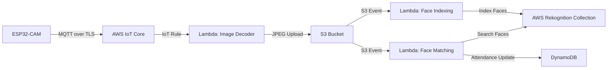

# AWS-Based Smart Attendance System using Face Recognition (IoT + Cloud)

> 📦 This repository contains an **academic, proof-of-concept project** developed as part of a college course.  
> It demonstrates an **end-to-end IoT → Cloud → AI pipeline** for automated attendance marking using face recognition.
>
> The repository is intended as a **learning and architectural showcase** and is not actively maintained.

<br>

## ⚠️ Important Disclaimer (Read First)

> [!WARNING]
> **Educational & Ethical Use Only**
>
> - This project was developed **strictly for academic purposes**.
> - All face recognition was conducted in a **consensual, controlled environment**.
> - The system is a **prototype** and **not intended for production deployment**.
> - No real credentials, private keys, or secrets are included in this repository.
> - Any sensitive values (Wi-Fi credentials, AWS certificates, endpoints) have been **intentionally redacted or replaced with placeholders**.
>
> **Use responsibly and in compliance with privacy, biometric, and data-protection regulations.**

<br>

## 📖 Introduction

### Background & Motivation

Manual attendance systems are inefficient, error-prone, and difficult to scale—especially in environments such as classrooms and laboratories. With the growth of **IoT devices, cloud computing, and AI services**, it is now possible to automate such workflows in a reliable and scalable manner.

This project explores how a **low-cost edge device (ESP32-CAM)** can be integrated with **AWS cloud services** to create a fully automated attendance pipeline powered by **face recognition**.

The focus of the project is not just face recognition, but the **complete system design**:
- Edge data capture
- Secure device-to-cloud communication
- Event-driven cloud processing
- Serverless architecture
- Persistent attendance storage

<br>

## 🎯 Objectives

- Build an **end-to-end attendance system** using IoT and AWS
- Capture images periodically from an ESP32-CAM
- Transmit images securely using **MQTT over TLS**
- Process images using **AWS Lambda**
- Perform face recognition using **AWS Rekognition**
- Store attendance records in **DynamoDB**
- Demonstrate real-world use of **event-driven serverless architecture**

<br>

## 🧠 High-Level System Overview

### What the system does

1. ESP32-CAM captures an image every **10 seconds**
2. Image is encoded as **Base64**
3. Image is sent securely to **AWS IoT Core** via MQTT
4. AWS IoT Rule triggers a **Lambda function**
5. Image is decoded and stored in **Amazon S3**
6. S3 upload triggers:
   - Face indexing (for enrollment)
   - Face matching (for attendance)
7. Attendance is marked in **DynamoDB** based on:
   - Face match confidence
   - Time difference (≥ 30 minutes)
   - Class period (IST)

<br>

## 🏗️ Architecture Diagram



<br>

## 🔌 Edge Device: ESP32-CAM

### Responsibilities

* Capture images using onboard camera
* Encode image data to Base64
* Publish JSON payloads to AWS IoT Core
* Maintain secure TLS connection using X.509 certificates

### Key Characteristics

* Image capture interval: **10 seconds**
* Communication protocol: **MQTT**
* Transport security: **TLS (Port 8883)**

> 🔒 **Note:**
> All credentials, certificates, and private keys are intentionally excluded from this repository.

<br>

## ☁️ Cloud Components (AWS)

### 1️⃣ AWS IoT Core

* Acts as the secure entry point for IoT messages
* Authenticates ESP32 using X.509 certificates
* Routes messages using IoT Rules

<br>

### 2️⃣ Lambda — Image Ingestion

**Trigger:** AWS IoT Rule
**Function:**

* Decodes Base64 image payload
* Generates timestamp-based filename
* Uploads image to Amazon S3

<br>

### 3️⃣ Amazon S3

* Temporary storage for captured images
* Acts as an event source for downstream processing

<br>

### 4️⃣ Lambda — Face Indexing

**Trigger:** S3 Object Created
**Function:**

* Indexes detected faces into a Rekognition Collection
* Uses `ExternalImageId` (mapped to student roll number)

<br>

### 5️⃣ Lambda — Attendance Processing

**Trigger:** S3 Object Created
**Function:**

* Searches face against Rekognition Collection
* Applies confidence threshold (≥ 95%)
* Converts timestamp to **IST**
* Determines class period
* Updates attendance in DynamoDB

<br>

### 6️⃣ AWS Rekognition

* Managed face recognition service
* Stores facial embeddings in a persistent collection
* Used **as-is**, without custom ML logic

<br>

### 7️⃣ DynamoDB

* Stores attendance records using:

  * `RollNumber` (Partition Key)
  * `Date` (Sort Key)
* Tracks:

  * In-time
  * Out-time
  * Attendance status per period

<br>

## ⏱️ Attendance Logic

* Attendance periods: **9 AM – 4 PM (IST)**
* Periods are hourly (1–7)
* A student is marked **Present** if:

  * Face match confidence ≥ 95%
  * Time difference between first and last detection ≥ 30 minutes (to reduce misuse and ensure sustained presence)
  * Detection occurs within a valid period

<br>

## 📂 Project Structure (Logical)

```text
.
├── esp32/
│   └── esp32_cam_mqtt.ino
│
├── lambdas/
│   ├── image_ingest_lambda.py
│   ├── face_index_lambda.py
│   └── attendance_lambda.py
│
├── README.md
└── .gitignore
```

<br>

## 🔐 Security Considerations

* No secrets are committed
* All credentials are replaced with placeholders
* `.gitignore` excludes:

  * Certificates
  * Private keys
  * Environment configs
* Designed following **least-privilege IAM principles**

<br>

## ⚖️ Ethics & Privacy

* Explicit **consent was assumed** during data collection
* System was deployed in a **controlled academic environment**
* No public or unauthorized biometric data was processed
* This repository exists purely for **educational demonstration**

<br>

## 🧪 Project Status

* ✅ Core pipeline implemented
* ❌ Frontend / dashboard not implemented
* ❌ Firebase integration planned but not completed
* 📦 Repository archived as a learning artifact

<br>

## 🏁 Conclusion

This project demonstrates how **IoT, cloud services, and AI** can be combined to build a real-world, event-driven system using modern architectural patterns.

Beyond face recognition, the project highlights:

* Secure device-to-cloud communication
* Serverless, scalable processing
* Practical use of managed AI services
* Clean separation between edge, compute, and data layers

It serves as a strong **academic and architectural showcase** for cloud-native system design.

<br>

## 📜 License

MIT License
Provided **as-is**, for educational and learning purposes.